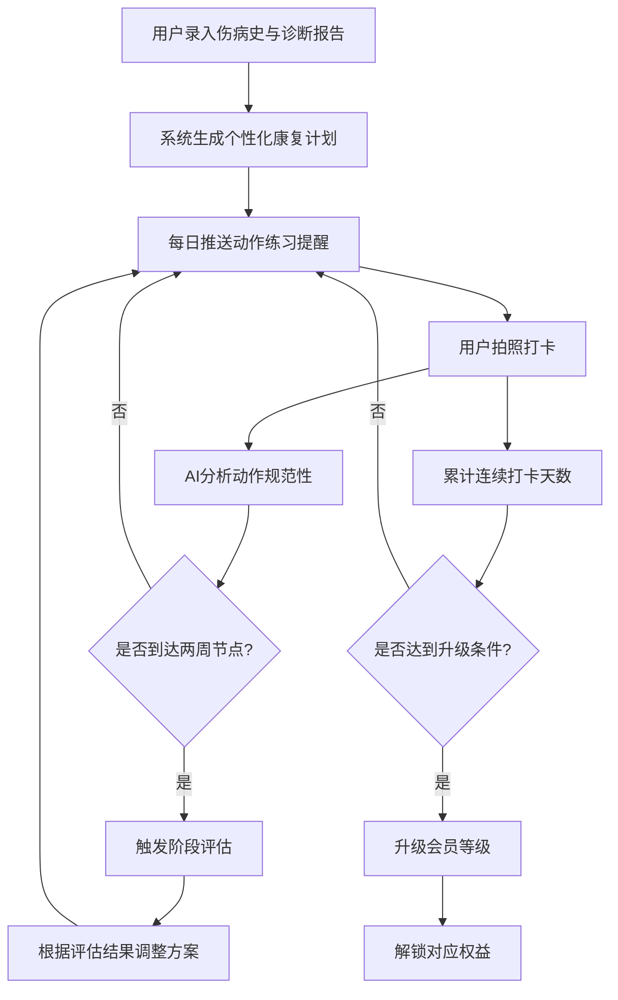

## 1. 产品概述

个人运动康复与物理治疗管理APP，为运动损伤患者提供从伤病史录入、个性化康复计划生成、每日动作练习与智能纠姿、阶段评估与方案调整，到康复师在线答疑与视频指导的完整闭环康复管理服务。

- 目标用户：运动损伤患者、术后康复人群、慢性疼痛管理人群
- 核心价值：通过AI驱动的动作分析与动态方案调整，将传统线下康复流程数字化，提升康复效率与依从性

## 2. 核心功能

### 2.1 用户角色

| 角色 | 注册方式 | 核心权限 |
|------|----------|----------|
| 普通用户（患者） | 手机号/邮箱注册 | 录入伤病史、查看康复计划、每日打卡、预约视频指导、会员管理 |
| 康复师 | 管理员邀请注册 | 审核用户计划、在线答疑、视频指导、排班管理 |
| 管理员 | 系统内置 | 管理看板、康复师管理、系统配置 |

### 2.2 功能模块

1. **首页仪表盘**：今日康复任务概览、打卡状态、康复进度环形图、会员等级与升级进度
2. **伤病史与诊断**：录入伤病史、上传诊断报告、查看历史记录
3. **康复计划中心**：自动生成个性化计划、查看每日动作列表、计划日历视图
4. **每日打卡**：动作练习提醒、上传动作照片、AI规范性分析与纠正建议
5. **阶段评估**：每两周自动触发、测评问卷与动作测试、根据结果动态调整方案
6. **康复师互动**：在线答疑、计划审核通知、预约一对一视频指导
7. **会员体系**：银卡/金卡等级、权益展示、升级进度、连续打卡天数
8. **管理看板**：康复师排班、用户康复进度分布、干预建议、数据统计

### 2.3 页面详情

| 页面名称 | 模块名称 | 功能描述 |
|----------|----------|----------|
| 首页仪表盘 | 今日任务卡片 | 展示今日待完成动作列表与完成状态 |
| 首页仪表盘 | 康复进度环 | 以环形图展示整体康复完成百分比 |
| 首页仪表盘 | 会员等级卡 | 显示当前会员等级、连续天数、升级进度条 |
| 首页仪表盘 | 提醒横幅 | 推送每日练习提醒、评估通知、升级通知 |
| 伤病史录入 | 伤病表单 | 填写受伤部位、受伤时间、伤情描述 |
| 伤病史录入 | 诊断报告上传 | 拍照或选择图片上传诊断报告，支持OCR解析 |
| 伤病史录入 | 历史记录列表 | 按时间线展示所有伤病史和诊断记录 |
| 康复计划 | 计划概览 | 展示当前康复计划的阶段、周期、目标 |
| 康复计划 | 每日动作列表 | 展示今日需完成的动作，含动作名称、组数、次数 |
| 康复计划 | 动作详情 | 动作示范图/视频、要点说明、常见错误 |
| 康复计划 | 日历视图 | 按月展示每日训练安排与完成状态 |
| 每日打卡 | 打卡入口 | 点击开始今日训练，逐项完成动作打卡 |
| 每日打卡 | 拍照上传 | 对每个动作拍摄照片上传，支持前后对比 |
| 每日打卡 | AI分析结果 | 自动分析动作规范性，展示评分与纠正建议 |
| 每日打卡 | 打卡完成页 | 展示今日训练总结、连续打卡天数 |
| 阶段评估 | 评估触发 | 每两周自动弹出评估提醒，进入评估流程 |
| 阶段评估 | 测评问卷 | 填写疼痛评分、功能自评等问卷 |
| 阶段评估 | 动作测试 | 按引导完成指定动作并拍照上传 |
| 阶段评估 | 评估报告 | 展示评估结果与方案调整建议 |
| 康复师互动 | 在线答疑 | 与康复师文字/图片交流，消息列表 |
| 康复师互动 | 计划审核 | 查看康复师对计划的审核意见与修改 |
| 康复师互动 | 预约视频 | 选择日期时段预约，系统自动匹配空闲康复师 |
| 康复师互动 | 视频指导 | 一对一视频通话界面，含动作演示画中画 |
| 会员中心 | 等级展示 | 银卡/金卡权益对比、当前等级高亮 |
| 会员中心 | 升级进度 | 连续打卡天数、付费等级、距离下一级进度 |
| 会员中心 | 权益使用 | 无限次视频指导次数、优先匹配记录 |
| 管理看板 | 康复师排班 | 日历视图展示康复师排班与空闲时段 |
| 管理看板 | 用户进度分布 | 按康复阶段分布的用户统计图表 |
| 管理看板 | 干预建议 | 系统识别需干预用户并给出建议 |

## 3. 核心流程

### 3.1 康复计划生成与执行流程

用户录入伤病史与诊断报告 → 系统根据伤病类型自动生成个性化康复计划 → 每日推送动作练习提醒 → 用户按引导完成动作并拍照打卡 → 系统AI分析动作规范性并给出纠正建议 → 每两周触发阶段评估 → 根据评估结果动态调整康复方案 → 循环执行直至康复完成

### 3.2 视频指导预约流程

用户选择预约日期与时段 → 系统查询该时段空闲康复师 → 自动匹配并创建视频会议链接 → 发送通知给用户与康复师 → 到达预约时间进入视频指导 → 康复师在指导中标记关键建议 → 会后自动生成指导记录

### 3.3 会员升级流程

系统持续跟踪用户连续康复打卡天数 → 达到天数阈值或付费升级 → 自动计算升级进度并推送通知 → 升级后解锁对应权益（无限次视频指导、优先匹配资深康复师）

## 4. 用户界面设计

### 4.1 设计风格

- **主色调**：医疗蓝绿色系（#0EA5A0 为主色，#E8F8F7 为辅助浅色），传递专业、治愈、可信赖感
- **辅助色**：暖橙色（#FF8C42）用于强调和行动按钮，柔和绿色（#34D399）用于完成/成功状态
- **按钮风格**：圆角胶囊按钮（border-radius: 24px），主按钮带微阴影悬浮效果
- **字体**：标题使用 "Noto Sans SC" 700 字重，正文使用 "Noto Sans SC" 400 字重，数字使用等宽字体突出数据
- **布局风格**：左侧导航栏 + 右侧内容区，卡片式布局，圆角 16px 卡片带轻柔阴影
- **图标风格**：线性图标（Stroke 1.5px），搭配圆角方形背景色块
- **整体风格**：现代医疗科技感，大量留白与圆角，柔和渐变与微妙动效

### 4.2 页面设计概览

| 页面名称 | 模块名称 | UI元素 |
|----------|----------|--------|
| 首页仪表盘 | 今日任务卡片 | 白色圆角卡片，左侧彩色状态条，右侧完成勾选动画 |
| 首页仪表盘 | 康复进度环 | 渐变色环形进度条（蓝绿→翠绿），中心百分比数字 |
| 首页仪表盘 | 会员等级卡 | 渐变背景卡片（银色/金色），连续天数动画计数器 |
| 首页仪表盘 | 提醒横幅 | 顶部滑入通知条，左侧图标+文字，右侧操作按钮 |
| 伤病史录入 | 伤病表单 | 分步表单，步骤指示器，输入框聚焦时蓝色描边 |
| 伤病史录入 | 诊断报告上传 | 虚线拖拽区域，上传后缩略图预览，OCR解析加载动画 |
| 伤病史录入 | 历史记录列表 | 左侧时间轴线，右侧卡片，顶部状态标签 |
| 康复计划 | 计划概览 | 顶部阶段进度条，下方当前阶段详情卡片 |
| 康复计划 | 每日动作列表 | 垂直列表卡片，每项含动作缩略图、名称、组数/次数 |
| 康复计划 | 动作详情 | 顶部动作示范图/视频，下方要点卡片，底部纠错提示 |
| 康复计划 | 日历视图 | 月历网格，已完成日期绿点，未完成灰点，当日高亮 |
| 每日打卡 | 打卡入口 | 大号圆形开始按钮，脉冲动画 |
| 每日打卡 | 拍照上传 | 全屏取景框，动作轮廓参考线叠加，底部拍摄按钮 |
| 每日打卡 | AI分析结果 | 顶部动作评分环形图，下方逐项分析列表，纠正建议卡片 |
| 每日打卡 | 打卡完成页 | 庆祝动画，连续天数计数器翻转，今日训练统计 |
| 阶段评估 | 评估触发 | 居中弹窗，渐变背景，进度提示 |
| 阶段评估 | 测评问卷 | 滑块式疼痛评分，星级功能自评，分步提交 |
| 阶段评估 | 评估报告 | 雷达图展示各维度评分，对比上次变化箭头 |
| 康复师互动 | 在线答疑 | 聊天气泡界面，左侧康复师/右侧用户，图片内嵌 |
| 康复师互动 | 预约视频 | 日历选择器+时段网格，空闲绿色/已约灰色，一键预约 |
| 康复师互动 | 视频指导 | 全屏视频通话，画中画动作演示，底部工具栏 |
| 会员中心 | 等级展示 | 双卡并列对比，当前等级卡片发光效果，权益图标列表 |
| 会员中心 | 升级进度 | 水平进度条，渐变填充，里程碑节点标记 |
| 管理看板 | 康复师排班 | 甘特图日历，拖拽调整排班，空闲时段绿色高亮 |
| 管理看板 | 用户进度分布 | 堆叠柱状图+饼图，按康复阶段分色 |
| 管理看板 | 干预建议 | 警告卡片列表，左侧红色/橙色/黄色严重度标识 |

### 4.3 响应式设计

- 桌面端优先（1440px 基准），平板端（768px-1024px）侧边栏折叠为汉堡菜单，移动端（<768px）底部Tab导航
- 触控优化：所有可交互元素最小点击区域 44px，打卡按钮加大至 64px

### 4.4 动效设计

- 页面切换：淡入+轻微上移（200ms ease-out）
- 卡片悬浮：阴影加深+轻微上浮（150ms）
- 进度环加载：从0到目标值的缓动动画（800ms ease-out）
- 打卡完成：纸屑庆祝动画
- 通知推送：顶部滑入（300ms ease-out）
