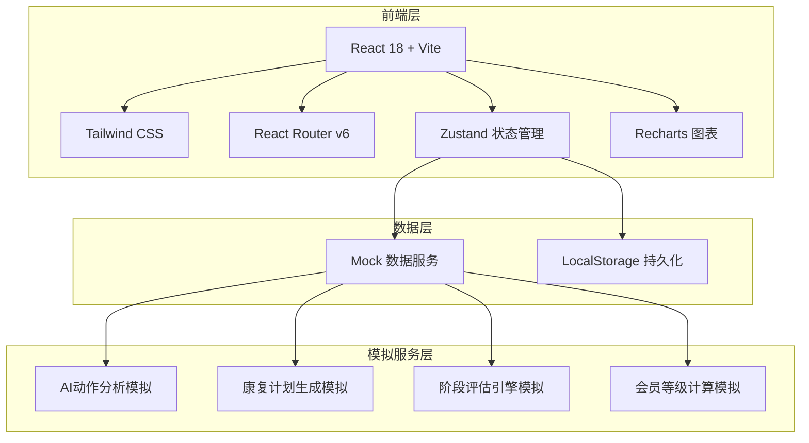
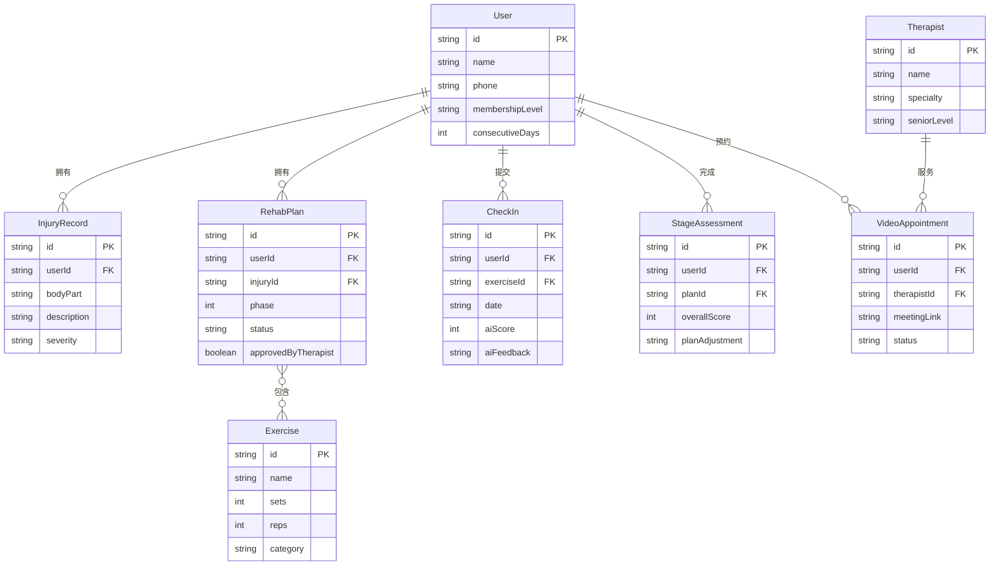

## 1. 架构设计



## 2. 技术说明

- **前端框架**：React@18 + TypeScript
- **构建工具**：Vite
- **样式方案**：Tailwind CSS@3
- **路由**：React Router v6
- **状态管理**：Zustand（轻量级，适合中等复杂度应用）
- **图表库**：Recharts（康复进度、管理看板数据可视化）
- **图标库**：Lucide React
- **动画**：Framer Motion
- **初始化工具**：vite-init
- **后端**：无（纯前端 + Mock数据模拟所有业务逻辑）
- **数据库**：LocalStorage + 内存数据（模拟用户、康复师、计划等数据）

## 3. 路由定义

| 路由 | 用途 |
|------|------|
| `/` | 重定向至 /dashboard |
| `/dashboard` | 首页仪表盘，展示今日任务、康复进度、会员状态 |
| `/injury` | 伤病史录入与诊断报告管理 |
| `/plan` | 康复计划中心，展示个性化计划与每日动作 |
| `/checkin` | 每日打卡，动作拍照与AI分析 |
| `/assessment` | 阶段评估，测评问卷与报告 |
| `/therapist` | 康复师互动，答疑与视频预约 |
| `/membership` | 会员中心，等级与权益管理 |
| `/admin` | 管理看板，康复师排班与数据统计 |

## 4. API 定义（Mock 数据接口）

### 4.1 用户相关

```typescript
interface User {
  id: string;
  name: string;
  avatar: string;
  phone: string;
  membershipLevel: "free" | "silver" | "gold";
  consecutiveDays: number;
  joinDate: string;
}

interface InjuryRecord {
  id: string;
  userId: string;
  bodyPart: string;
  injuryDate: string;
  description: string;
  diagnosisReport?: string;
  severity: "mild" | "moderate" | "severe";
  createdAt: string;
}
```

### 4.2 康复计划相关

```typescript
interface RehabPlan {
  id: string;
  userId: string;
  injuryId: string;
  phase: number;
  totalPhases: number;
  startDate: string;
  endDate: string;
  exercises: Exercise[];
  therapistId: string;
  status: "active" | "paused" | "completed";
  approvedByTherapist: boolean;
}

interface Exercise {
  id: string;
  name: string;
  description: string;
  imageUrl: string;
  sets: number;
  reps: number;
  duration: number;
  category: "stretch" | "strength" | "mobility" | "balance";
  keyPoints: string[];
  commonErrors: string[];
}
```

### 4.3 打卡与分析相关

```typescript
interface CheckIn {
  id: string;
  userId: string;
  planId: string;
  exerciseId: string;
  date: string;
  photoUrl: string;
  aiScore: number;
  aiFeedback: string;
  corrections: string[];
  completed: boolean;
}

interface StageAssessment {
  id: string;
  userId: string;
  planId: string;
  date: string;
  painScore: number;
  functionScore: number;
  rangeOfMotion: number;
  strengthScore: number;
  overallScore: number;
  planAdjustment: string;
  previousScore?: number;
}
```

### 4.4 康复师与预约相关

```typescript
interface Therapist {
  id: string;
  name: string;
  avatar: string;
  specialty: string[];
  rating: number;
  seniorLevel: "junior" | "senior" | "expert";
  schedule: ScheduleSlot[];
}

interface ScheduleSlot {
  date: string;
  startTime: string;
  endTime: string;
  isAvailable: boolean;
  appointmentId?: string;
}

interface VideoAppointment {
  id: string;
  userId: string;
  therapistId: string;
  date: string;
  startTime: string;
  endTime: string;
  meetingLink: string;
  status: "upcoming" | "in_progress" | "completed" | "cancelled";
  notes?: string;
}
```

### 4.5 会员相关

```typescript
interface MembershipConfig {
  level: "free" | "silver" | "gold";
  requiredDays: number;
  requiredPayment: number;
  benefits: string[];
  videoGuidanceLimit: number | "unlimited";
  priorityMatching: boolean;
}
```

## 5. 数据模型

### 5.1 数据模型定义



## 6. 项目目录结构

```
src/
├── assets/            # 静态资源
├── components/        # 通用组件
│   ├── Layout/        # 布局组件（Sidebar, Header）
│   ├── Cards/         # 卡片组件
│   └── Charts/        # 图表组件
├── pages/             # 页面组件
│   ├── Dashboard/     # 首页仪表盘
│   ├── Injury/        # 伤病史管理
│   ├── Plan/          # 康复计划
│   ├── CheckIn/       # 每日打卡
│   ├── Assessment/    # 阶段评估
│   ├── Therapist/     # 康复师互动
│   ├── Membership/    # 会员中心
│   └── Admin/         # 管理看板
├── store/             # Zustand 状态管理
├── mock/              # Mock数据
├── types/             # TypeScript类型定义
├── utils/             # 工具函数
├── App.tsx            # 应用入口
└── main.tsx           # 渲染入口
```
